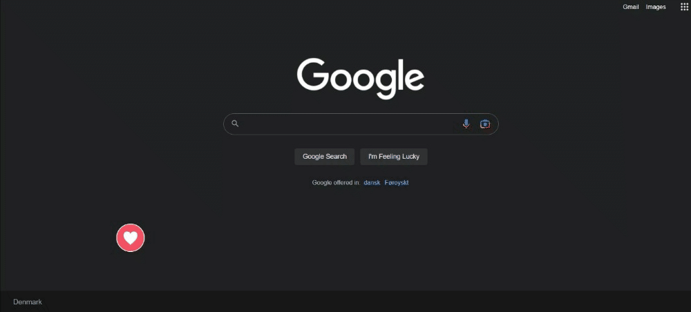

# Description

I want attention is a chrome extension that allows the user to quickly send an email to a desired mail address.

## Functionality

The extension simply adds a button, which floats randomly thorughout the browser window, and once clicked, it sends an email to the address specified inside the source code.



The default values of the subject and body of the email are as such:

```
Subject: I want attention!
Body: I want attention :)
```

These text values can, however, be modified by the user to anything they wish.

## Domains

The given extension currently works on google.com and all of its subdomains. To change the extension such that it works on other domains, simply modify all fields of type ``` matches ```, 

```json 
"matches": ["https://www.google.com/*"],
```

in the ``` manifest.json``` file to the desired domain.

### NB:
The functionality of sending an email should reside in a ``` index.js``` file. In order to not leak smtp credentials, a similar file called ```github_index.js``` is uploaded to github using fake credentials. The following portion of the file needs to be changed to appropriate fields:

```js
Email.send({
    Host: "smtp.elasticemail.com",
    Username: "elatic_username",
    Password: "elastic_password",
    Port: 2525,
    To: "reciever",
    From: "elatic_username",
    Subject: settings[0],
    Body: settings[1]
}).then(
    ...
);
```